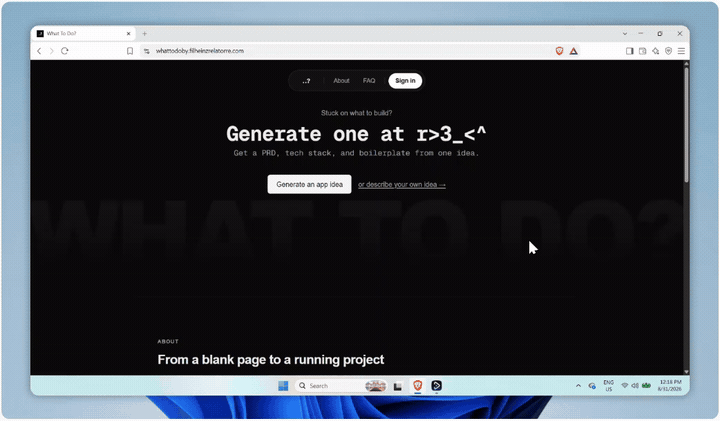

# What To Do

**From an idea to a scoped, scaffolded, running project in one prompt.**

[](https://whattodoby.filheinzrelatorre.com)


<br>

<p align="center"></p>

Describe an app idea in a sentence and What To Do turns it into a full PRD, a recommended tech stack with reasoned alternatives, and a downloadable boilerplate project scaffolded to match, with a live in-browser preview before you ever download a single file.

## Try it

**Live:** [whattodoby.filheinzrelatorre.com](https://whattodoby.filheinzrelatorre.com) - no account needed to generate a PRD and preview a boilerplate; sign in to save projects.

## How it works

1. **Idea to PRD** - a short prompt is expanded into a structured product-requirements document (problem, scope, sections, edge cases) via Groq.
2. **PRD to stack recommendation** - the PRD is matched against a stack matrix (framework, database, auth, hosting) with a primary pick plus alternatives and the reasoning behind each.
3. **Stack to boilerplate** - a real, runnable project is generated from a registry of templates (currently Next.js + Postgres + Drizzle, FastAPI + Postgres) and zipped for download.
4. **Live verification** - the generated project boots in-browser via WebContainer before download, so what you get is a project that's already been proven to run, not just a set of files that should.

## Tech stack

| Layer | Choice |
|---|---|
| Framework | Next.js 16 (App Router), React 19, TypeScript |
| Auth | NextAuth (Auth.js) with Drizzle adapter |
| Database | PostgreSQL (Neon) via Drizzle ORM |
| LLM | Groq |
| In-browser runtime | WebContainer API (live boilerplate preview) |
| Object storage | Cloudflare R2 (S3-compatible, AWS SDK client) |
| Jobs / caching | Upstash QStash + Redis |
| Validation | Zod |
| Styling | Tailwind CSS v4 |

## Local setup

```bash
pnpm install
cp .env.example .env       # fill in the values
pnpm db:generate            # generate Drizzle migrations
pnpm db:migrate              # apply migrations
pnpm dev                     # http://localhost:3000
```

## Scripts

```bash
pnpm dev             # dev server
pnpm build            # production build
pnpm start             # serve the production build locally
pnpm lint               # eslint
pnpm db:generate         # generate a Drizzle migration from schema
pnpm db:migrate           # apply migrations
pnpm r2:lifecycle          # configure R2 bucket lifecycle rules
```

## Deployment

Deployed on Vercel, connected to this repository. Push to `master` to deploy.

---

## About the developer

**Fil Heinz O. Re La Torre** - Automation & AI Solutions Engineer, building integrations and AI-backed workflows that go from idea to production in days.

[](https://www.filheinzrelatorre.com)
[](https://ph.linkedin.com/in/filheinzrelatorre)
[](https://github.com/jabluetooth)
[](mailto:filheinz27@gmail.com)

**Other projects:** [Match](https://github.com/jabluetooth/match) · [ZeroPress](https://github.com/jabluetooth/zeropress) · [Mimo](https://github.com/jabluetooth/mimo) · [Insight](https://github.com/jabluetooth/insight) · [see all →](https://github.com/jabluetooth)
